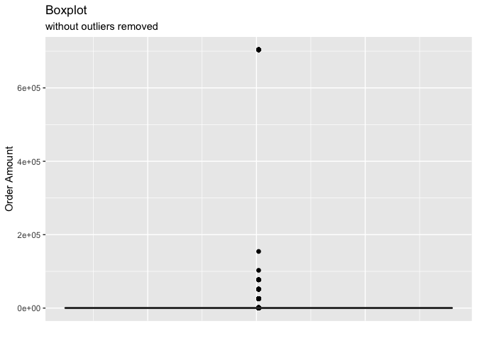
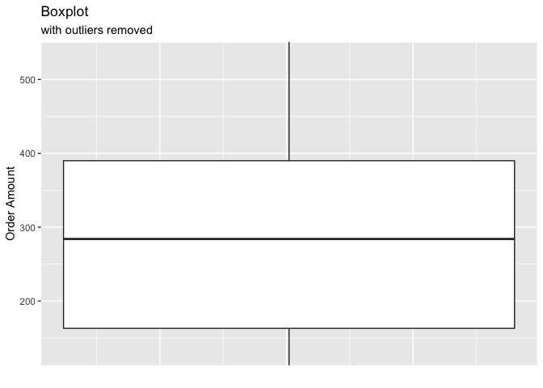

Q1
================

# Question 1: Given some sample data, write a program to answer the following: click here to access the required data set

On Shopify, we have exactly 100 sneaker shops, and each of these shops
sells only one model of shoe. We want to do some analysis of the average
order value (AOV). When we look at orders data over a 30 day window, we
naively calculate an AOV of $3145.13. Given that we know these shops are
selling sneakers, a relatively affordable item, something seems wrong
with our analysis.

### Think about what could be going wrong with our calculation. Think about a better way to evaluate this data.

First, we need to ask ourselves why the Average Order Value was
previously calculated incorrectly. By dividing the sum of the
“order_amount” by the number of orders present across all 100 shops, we
end up with a mean of $3145.13. However, we are trying to find the
average dollar amount spent each time a customer places an order, and
not the mean value of the total order amount.

``` r
data <- read_excel("~/Downloads/2019 Winter Data Science Intern Challenge Data Set.xlsx")
glimpse(data) 
```

    ## Rows: 5,000
    ## Columns: 7
    ## $ order_id       <dbl> 1, 2, 3, 4, 5, 6, 7, 8, 9, 10, 11, 12, 13, 14, 15, 16, …
    ## $ shop_id        <dbl> 53, 92, 44, 18, 18, 58, 87, 22, 64, 52, 66, 40, 54, 100…
    ## $ user_id        <dbl> 746, 925, 861, 935, 883, 882, 915, 761, 914, 788, 848, …
    ## $ order_amount   <dbl> 224, 90, 144, 156, 156, 138, 149, 292, 266, 146, 322, 3…
    ## $ total_items    <dbl> 2, 1, 1, 1, 1, 1, 1, 2, 2, 1, 2, 2, 2, 1, 3, 2000, 1, 1…
    ## $ payment_method <chr> "cash", "cash", "cash", "credit_card", "credit_card", "…
    ## $ created_at     <dttm> 2017-03-13 12:36:56, 2017-03-03 17:38:51, 2017-03-14 0…

``` r
ggplot(data=data, aes(x=shop_id,y=order_amount, group = 1)) +
  geom_boxplot(outlier.colour="black", outlier.shape=16, outlier.size=2, notch=FALSE) +
  labs(title = "Boxplot", subtitle = "without outliers removed", x = " ", y = "Order Amount") +
  theme(axis.ticks.x = element_blank(), axis.text.x = element_blank())
```

<!-- -->

``` r
ggplot(data=data, aes(x=shop_id,y=order_amount, group = 1)) +
  geom_boxplot(outlier.colour="black", outlier.shape=16, outlier.size=2, notch=FALSE) +
  coord_cartesian(ylim = quantile(data$order_amount, c(0.10, 0.90))) +
  labs(title = "Boxplot", subtitle = "with outliers removed", x = " ", y = "Order Amount") +
  theme(axis.ticks.x = element_blank(), axis.text.x = element_blank())
```

<!-- --> When we view the
two graphs, it is no wonder why the previously calculated mean of
$3145.13 was so high. In shops 42 and 78, they both have a large
“order_amount” in comparison to the other 98 shops. Consequently, both
shops 42 and 78 also have a much larger AOV.

Therefore, a better way to evaluate this data would be to find the AOV
of each individual shop, then find the median of the collective AOV.

``` r
data_aov <- data %>%
  group_by(shop_id) %>%
  summarize(aov = sum(order_amount)/(length(order_id)))

median(data_aov$aov)
```

    ## [1] 308.8898

### What metric would you report for this dataset?

Why the median? If we were to use the mean or average of the order
value, it would continue to be heavily influenced by the extreme
outliers in shops 42 and 78. By using the median as the metric, we are
able to discern the “typical” value without having the proportions of
shops 42 and 78 skewing its value.

### What is its value?

The median order value is $308.8898, a more reasonable calculation for a
relatively affordable item.
